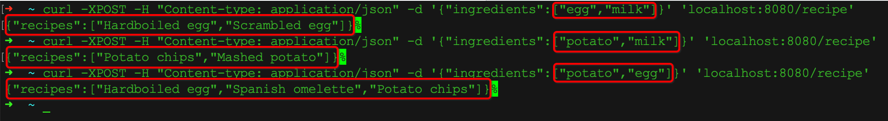

## Env requirement
* JDK: 1.8.0_291
* Maven: 3.6.3
* Docker: 20.10.5

## Steps to run
1. clone this project.  
`git clone git@github.com:wanxiaolong/CookbookServiceDemo.git`

2. build this project into jar file.  
this step will generated the jar file under targes folder.  
`mvn clean package`

3. build a docker image.  
this step will copy the generated jar file into the docker image.  
`docker build -t cookbook:v1 .`

4. run images using docker-compose.  
this step will configure mysql container, and insert the required data.  
`docker-compose up -d`

5. test this service using curl.  
`curl -XPOST -H "Content-type: application/json" -d '{"ingredients":["egg","milk"]}' 'localhost:8080/recipe'`

   you will get below content as response:  
`{"recipes":["Hardboiled egg","Scrambled egg"]}`

   Here is the test results:

